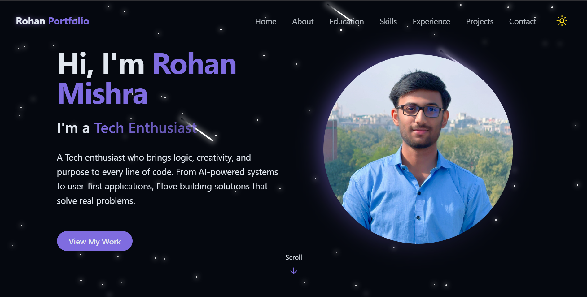

# Rohan Mishra's Personal Portfolio



Welcome to the repository for my personal portfolio website. This project is a modern, responsive, and animated single-page application built to showcase my skills, experience, and projects as a software engineer.

**[View Live Demo](https://[your-live-url.com])**

---

## ✨ Features

- **Sleek & Modern Design**: A clean, visually appealing UI with a consistent theme.
- **Dynamic Typewriter Effect**: An engaging hero section that showcases my various roles and skills.
- **Dark & Light Mode**: A theme toggle for user preference, with settings saved to local storage.
- **Animated Background**: A subtle, animated starfield background with shooting meteors for a "wow" factor.
- **Fully Responsive**: The layout is optimized for all screen sizes, from mobile phones to desktop monitors.
- **Interactive UI**: Smooth scrolling, hover effects, and on-scroll reveal animations to create an engaging user experience.
- **Structured Content**: Sections for About Me, Education, Experience, Skills, and Projects are logically organized and easy to navigate.
- **Functional Contact Form**: A toast notification provides instant feedback upon form submission.

---

## 🛠️ Tech Stack

This project is built with a modern and robust set of technologies:

| Category          | Technology                                                                                                                                                                                                                                                                |
| ----------------- | ------------------------------------------------------------------------------------------------------------------------------------------------------------------------------------------------------------------------------------------------------------------------- |
| **Core**          |                                                                             |
| **Styling**       |                                                  |
| **Routing**       |                                                                                                                                                      |
| **UI & Components** |  (for Toast)                                                                                                                                                       |
| **Animations**    |  (Implicit via Tailwind animations) & `react-type-animation`                                                                                                 |
| **Icons**         |                                                                                                                                                                                                   |
| **Linting**       |                                                                                                                                                                        |
| **Deployment**    |  /                                                                  |

---

## 🚀 Getting Started

To run this project locally, follow these steps:

1.  **Clone the repository:**
    ```bash
    git clone https://github.com/rohan1883/Portfolio.git
    cd Portfolio
    ```

2.  **Install dependencies:**
    This project uses `npm` as the package manager.
    ```bash
    npm install
    ```

3.  **Run the development server:**
    This will start a local server, usually at `http://localhost:5173`.
    ```bash
    npm run dev
    ```

4.  **Build for production:**
    To create an optimized production build, run:
    ```bash
    npm run build
    ```
    The output will be in the `dist/` directory.

---

## 📦 Deployment

This site is automatically deployed via **Vercel** (or Netlify). Every push to the `main` branch triggers a new build and deployment, ensuring the live site is always up-to-date with the latest changes.

---

## 📜 License

This project is licensed under the MIT License. See the [LICENSE](LICENSE.md) file for details.

---

## Contact

Rohan Mishra - [@LinkedIn](https://www.linkedin.com/in/rohankr1883) - rohankr1808@gmail.com

Project Link: [https://github.com/rohan1883/Portfolio](https://github.com/rohan1883/Portfolio)